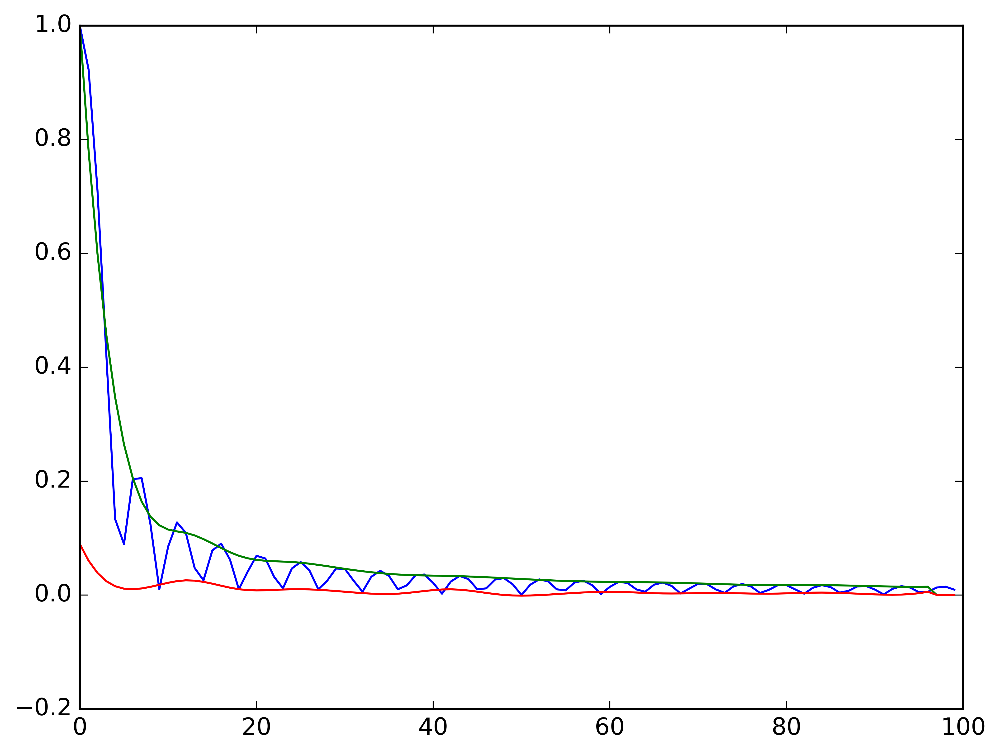

Usage of Nutcracker
===================

Follwing section trys to show an overview of how to execute *Nutcracker* functions. The denotation should be in accordance with :ref:`introduction <introduction>`. Not all functions are shown. More informations about the single functions can be found under the link to the function.

Intensities module
------------------

Fourier-Shell/Ring-Correlation
^^^^^^^^^^^^^^^^^^^^^^^^^^^^^^

:meth:`nutcracker.intensities.fourier_shell_correlation`

.. code::

    import nutcracker
    import numpy as np

    F1 = np.random.random((10,10)) #Fourier-Transform
    F2 = np.random.random((10,10)) #Fourier-Transforms

    FSC = nutcracker.intensities.fourier_shell_correlation(F1, F2)

Q-factor
^^^^^^^^

:meth:`nutcracker.intensities.q_factor`

.. code::

    import nutcracker
    import numpy as np
    
    Fn = np.random.random((5,10,10)) #Set of Fourier-Transform 
    Q = nutcracker.intensities.q_factor(Fn)

Split image function 
^^^^^^^^^^^^^^^^^^^^

:meth:`nutcracker.intensities.split_image`

.. code::

    import nutcracker
    import numpy as np
    
    F = np.random.random((8,8)) #Initial image

    F1, F2 = nutcracker.intensities.split_image(F, factor=2)

Quaternions module
------------------

Compare two sets of quaternions
^^^^^^^^^^^^^^^^^^^^^^^^^^^^^^^

:meth:`quaternions.compare_two_sets_of_quaternions`

.. code::

   import nutcracker
   import condor
   import numpy as np

   q1 = []
   for in range(10):
       q1.append(condor.utils.rotation.rand_quat())
   q1 = np.array(q_1)

   q2 = []
   for in range(10):
       q2.append(condor.utils.rotation.rand_quat())
   q2 = np.array(q2)

   output = quaternions.compare_two_sets_of_quaternions(q1, q2, n_samples=10, full_output=True, q1_is_extrinsic=True, q2_is_extrinsic=True)

Global quaternion rotation between two sets
^^^^^^^^^^^^^^^^^^^^^^^^^^^^^^^^^^^^^^^^^^^

:meth:`quaternions.global_quaternion_rotation_between_two_sets` 

.. code::

   import nutcracker
   import condor
   import numpyas np

   q1 = []
   for in range(10):
       q1.append(condor.utils.rotation.rand_quat())
   q1 = np.array(q_1)

   q2 = []
   for in range(10):
       q2.append(condor.utils.rotation.rand_quat())
   q2 = np.array(q2)

   output = quaternions.global_quaternion_rotation_between_two_sets(q1, q2, full_output=True, q1_is_extrinsic=True, q2_is_extrinsic=True)

Real-space module
-----------------

Phase-Retrieval-Transfer-Function
^^^^^^^^^^^^^^^^^^^^^^^^^^^^^^^^^

:meth:`nutcracker.real_space.phase_retieval_transfer_function`

.. code::

    import nutcracker
    import numpy as np

    img = np.random.random((8,10,10,10))
    sup = np.ones((8,10,10,10))

    PRTF_output = nutcracker.real_space.phase_retieval_transfer_function(img,sup,full_output=True)
    
    PRTF = PRTF_output['prtf_radial']

Submodules
----------

Rotate
^^^^^^

:meth:`nutcracker.utils.rotate.find_rotation_between_two_models`

.. code::

    import nutcracker
    import numpy as np

    Img_1 = np.random.random((10,10,10)) #intensity space volumes
    Img_2 = np.random.random((10,10,10)) #intensity space volumes

    output = nutcracker.utils.rotate.find_rotation_between_two_models(Img_2,Img_1,method='fmin_l_bfgs_b',
                                                                      radius_radial_mask=20./2,
                                                                      order_spline_interpolation=3,
                                                                      initial_guess=[0.0,0.0,0.0],
                                                                      full_output=True)
								      
    rotation_angles = output['rotation_angles']								      								      

Shift
^^^^^

:meth:`nutcracker.utils.shift.find_shift_between_two_models`

.. code::

    import nutcracker
    import numpy as np

    img_1 = np.random.random((10,10,10)) #real space volumes
    img_2 = np.random.random((10,10,10)) #real space volumes

    output = nutcracker.utils.shift.find_shift_between_two_models(img_2,img_1,full_output=True,method='brute_force')

    shift_values = output['shift_values']

Plot-analysis
^^^^^^^^^^^^^

:meth:`nutcracker.utils.plot_analysis.envelope`

.. code::
    
    import nutcracker
    import numpy as np

    x = np.arange(100)
    y = np.abs(np.sinc(0.22 * x))

    upper_envelope, lower_envelope = nutcracker.utils.plot_analysis.envelope(y,6)

    plt.figure()
    plt.plot(x,y)
    plt.plot(x,upper)
    plt.plot(x,lower)
    plt.show()    

Error matrix multiprocessed
^^^^^^^^^^^^^^^^^^^^^^^^^^^

:meth:`nutcracker.utils.run_error_matrix.main`

.. code::

    import nutcracker
    import numpy as np

    img_1 = ... # assuming img_1 is a file containing the dataset, e.g. 'real', of our image
    img_2 = ... # assuming img_2 is a file containing the dataset, e.g. 'real', of our image

    output = nutcracker.utils.run_error_matrix.main(model1_filename=img_1,
                                                    model2_filename=img_2,
                                                    model1_dataset='real',
                                                    model2_dataset='real',
                                                    number_of_processes=8,
                                                    chunck_size=10,
                                                    number_of_evaluations=20,
                                                    order_spline_interpolation=3,
                                                    radius_radial_mask=20./2)
    
    error_matrix = np.array(output['error_matrix']).reshape((3,20,20,20))
